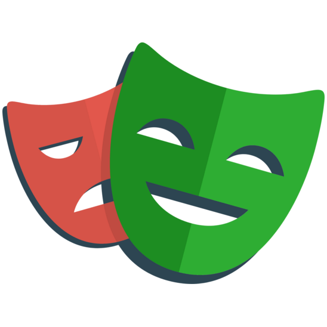
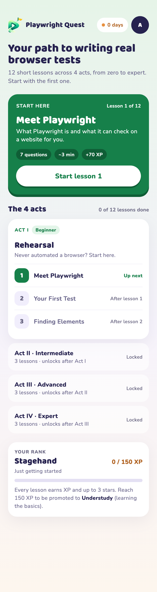
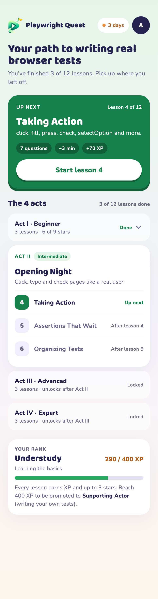

<div align="center">



# Playwright Quest

### From first test to pro

Bite-sized lessons and quizzes that teach you Playwright, one scene at a time.
No automation experience needed.

**[Try it live → playwright-quest.serverpod.space](https://playwright-quest.serverpod.space)**

</div>

---

## What it does

Playwright is the tool teams use to test websites automatically: a script opens
a real browser, clicks and types like a person would, and checks the page did
the right thing. It is powerful, but the first steps can feel like a lot.

Playwright Quest breaks it into a path you can finish on the bus:

- **Teaches** one idea per lesson with a short, plain-language explanation and
  a real code example.
- **Quizzes** you straight after, with instant feedback that explains *why*
  each answer is right, including fill-in-the-blank questions on real test code.
- **Levels you up** through 12 lessons in 4 acts: Beginner, Intermediate,
  Advanced and Expert.
- **Rewards** you with up to 3 stars per lesson, XP, a daily streak and ranks
  that go from Stagehand (just getting started) to Playwright (the top rank).
- **Remembers** your progress on the server, so you can pick up on any device.

Everything you learn maps to code you will actually write: locators, web-first
assertions, fixtures, network mocking, login state, CI and more.

## Try it

The app is live at **https://playwright-quest.serverpod.space**, hosted on
[Serverpod Cloud](https://serverpod.dev/cloud). Sign in with any email address:
you'll receive a 6-digit code by email, and your first sign-in creates your
account. If the code isn't in your inbox within a minute, check your spam or
junk folder. It works on phones and desktop browsers.

## Getting started

To run it on your own machine, you need [Flutter](https://docs.flutter.dev/get-started/install) 3.44+ and the
Serverpod CLI.

```bash
dart pub global activate serverpod_cli 4.0.0
cd playwright_app_server
cp config/passwords.yaml.example config/passwords.yaml
serverpod start
```

Fill `config/passwords.yaml` with your own random values first (for example
from `openssl rand -base64 32`). `serverpod start` runs the server, applies
the database migrations and launches the app. Then open http://localhost:9998.

To sign in, enter any email. While developing, no email is sent: the 6-digit
code appears in the `serverpod start` terminal.

Run the tests with `dart test` in `playwright_app_server` and `flutter test`
in `playwright_app_flutter`.

---

<div align="center">


&nbsp;&nbsp;


</div>

### Sign in without a password

Nobody wants to invent a password to try a learning app. Playwright Quest signs
you in with a one-time code instead: enter your email, type the 6 digits we
send you, and you are in. The same step creates your account the first time.

The codes are built to be safe:

- Only a keyed hash of each code is stored, never the code itself.
- A code works once, expires after 10 minutes and is cancelled after 5 wrong
  tries.
- Asking for a new code is limited to once every 30 seconds.
- The screen looks the same whether or not an account exists, so it never
  reveals who has signed up.

Answers are graded on the server too, so stars and XP reflect what you actually
got right.

---

## How it's built

- **[Serverpod](https://serverpod.dev)** runs the backend: the curriculum, the
  game rules, progress and sign-in, all in Dart with a PostgreSQL database.
- **[Flutter](https://flutter.dev)** runs the app, designed mobile-first and
  built for the web.
- **[Serverpod Cloud](https://serverpod.dev/cloud)** hosts the live server,
  database and web app; database migrations are applied on every deploy.

```
playwright_app_server/   Serverpod backend: lessons, game rules, sign-in, tests
playwright_app_flutter/  Flutter app
playwright_app_client/   Generated client (do not edit by hand)
```

The lessons live in
[`curriculum.dart`](playwright_app_server/lib/src/quiz/content/curriculum.dart),
so adding or editing a question is a one-file change, and a test checks the
content for mistakes.

<sub>Playwright Quest is an independent learning project and is not affiliated
with or endorsed by Microsoft or the Playwright project. The Playwright name
belongs to its owners; the Playwright Quest logo is original artwork.</sub>
